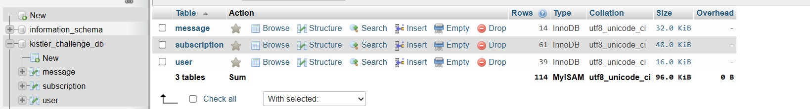
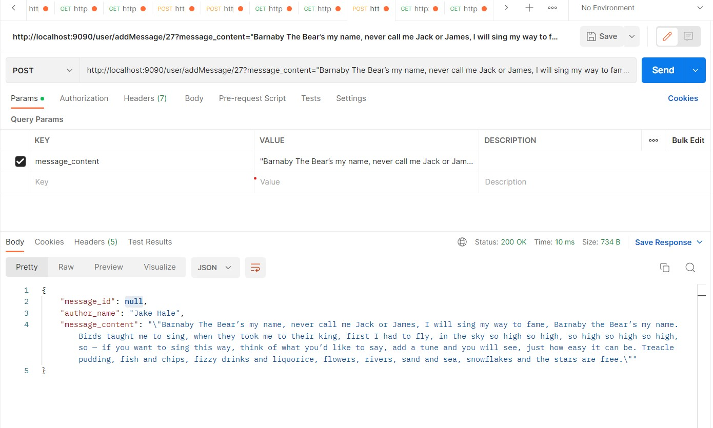
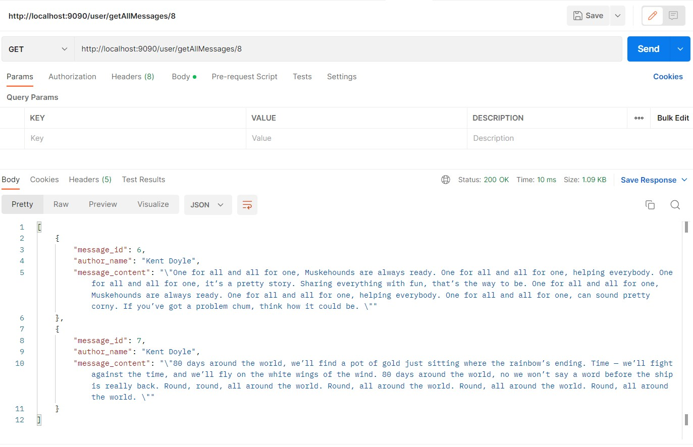

# KistlerAuthorChallenge Presentation
This is a simple API that handles the following use cases:
* User can add a message
* User can subscribe to other users
* Display all the messages posted by the user, including those posted by other users whom the user has subscribed to.
  ## Diagram class
  The API follow this diagram class where :
  * User can subscribe to 0 or many users
  * User can publish 0 or many messages
  * Message is published by a single user
    

## Technologies
This API was developed with :
* SpringBoot 2.7.12
* MySql Data Base
## Screenshots of the project
* OverView of the database structure :

* Usecase "Add a message" example :

* Usecase "Get All Messages" example :

